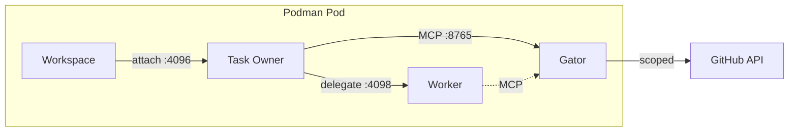

# devaipod

**Sandboxed AI coding agents in reproducible dev environments using podman pods**

Run AI agents with confidence: your code in a devcontainer, the agent in a separate container that only has limited access to the host system *and* limited network credentials (e.g. Github token).

Combines in an opinionated way:

- [OpenCode](https://github.com/anomalyco/opencode/) as agent framework
- [Podman](https://github.com/containers/podman/) for container isolation
- [Devcontainers](https://containers.dev/) as a specification mechanism
- [service-gator](https://github.com/cgwalters/service-gator) for fine-grained MCP access to GitHub/GitLab/Forgejo

## On the topic of AI

This tool is primarily authored by @cgwalters who would "un-invent" large language models if he could because he believes the long term negatives for society as a whole are likely to outweigh the gains. But since that's not possible, this project is about maximizing the positive aspects of LLMs with a focus on software production (but not exclusively). We need to use LLMs safely and responsibly, with efficient human-in-the-loop controls and auditability.

If you want to use LLMs, but have concerns about e.g. [prompt injection](https://simonwillison.net/tags/prompt-injection/) attacks from un-sandboxed agent use especially with unbound access to your machine secrets (especially e.g. Github token): then devaipod can help you.

## How It Works

devaipod uses podman pods to create a multi-container environment:

1. Parses your project's `devcontainer.json` to determine the image
2. Creates a podman pod with shared network namespace
3. Starts containers:
   - **workspace**: Your development environment with `opencode-connect` shim
   - **task owner**: Orchestrates work, runs `opencode serve` on port 4096
   - **worker**: Executes subtasks, runs `opencode serve` on port 4098
   - **gator**: The [service-gator](https://github.com/cgwalters/service-gator) MCP server for controlled access to GitHub/JIRA

All containers share the same network namespace, allowing localhost communication between containers.

## Key Features

- **Web UI** - browser-based dashboard for managing workspaces and monitoring agents (primary interface)
- **Runs as a container** - distributed as `ghcr.io/cgwalters/devaipod:latest`, no host installation needed beyond podman
- **Sandboxed agents** - task owner and worker containers are credential-isolated (no GH_TOKEN, etc.)
- **Task kickoff** - give the task owner a task and it starts working immediately
- **Auto service-gator** - remote URLs automatically get read + draft PR permissions
- **API keys via podman secrets** - agents receive `ANTHROPIC_API_KEY`, `OPENAI_API_KEY`, etc. securely
- **Network isolation** - optionally restrict agents to allowed LLM API domains via proxy
- **TUI and CLI** - terminal-based attach/monitoring also available via `podman exec`
- **macOS support** - works with podman machine on macOS

## Requirements

- **podman** (rootless works, including inside toolbox containers)
- A devcontainer image with `opencode` and `git` installed (e.g., [devenv-debian](https://github.com/bootc-dev/devenv-debian))
- A `devcontainer.json` in your project, OR a default image configured in `~/.config/devaipod.toml`

## License

Apache-2.0 OR MIT
