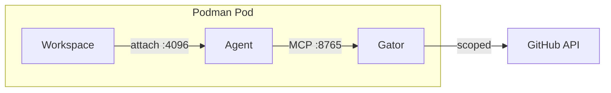

# devaipod

**Sandboxed AI coding agents in reproducible dev environments using podman pods**

Run AI agents with confidence: your code in a devcontainer, the agent in a separate container that only has limited access to the host system *and* limited network credentials (e.g. Github token).

Combines in an opinionated way:

- [OpenCode](https://github.com/anomalyco/opencode/) as agent framework
- [Podman](https://github.com/containers/podman/) for container isolation
- [Devcontainers](https://containers.dev/) as a specification mechanism
- [service-gator](https://github.com/cgwalters/service-gator) for fine-grained MCP access to GitHub/GitLab/Forgejo

## On the topic of AI

This tool is primarily authored by @cgwalters who would "un-invent" large language models if he could because he believes the long term negatives for society as a whole are likely to outweigh the gains. But since that's not possible, this project is about maximizing the positive aspects of LLMs with a focus on software production (but not exclusively). We need to use LLMs safely and responsibly, with efficient human-in-the-loop controls and auditability.

If you want to use LLMs, but have concerns about e.g. [prompt injection](https://simonwillison.net/tags/prompt-injection/) attacks from un-sandboxed agent use especially with unbound access to your machine secrets (especially e.g. Github token): then devaipod can help you.

## How It Works

devaipod uses podman pods to create a multi-container environment:

1. Parses your project's `devcontainer.json` to determine the image
2. Creates a podman pod with shared network namespace
3. Starts containers:
   - **workspace**: Your development environment with `opencode-connect` shim
   - **agent**: Runs `opencode serve` with credential isolation (no GH_TOKEN, etc.)
   - **gator**: The [service-gator](https://github.com/cgwalters/service-gator) MCP server for controlled access to GitHub/JIRA

All containers share the same network namespace, allowing localhost communication between the agent and workspace.

## Key Features

- **Native podman** - no devpod dependency for core workflow
- **Sandboxed agent** - agent container is credential-isolated (no GH_TOKEN, etc.)
- **Task kickoff** - give the agent a task and it starts working immediately
- **Auto service-gator** - remote URLs automatically get read + draft PR permissions
- **Workspace shim** - `opencode-connect` runs `opencode attach` to connect to the agent
- **API keys from environment** - agent receives `ANTHROPIC_API_KEY`, `OPENAI_API_KEY`, etc.
- **Network isolation** - optionally restrict agent to allowed LLM API domains via proxy
- **Env allowlist** - per-project env vars in devcontainer.json customizations
- **Toolbox compatible** - works inside toolbox containers
- **macOS support** - works with podman machine on macOS

## Requirements

- **podman** (rootless works, including inside toolbox containers)
- An image with `opencode` installed (e.g., [devenv-debian](https://github.com/bootc-dev/devenv-debian))
- A `devcontainer.json` in your project (`.devcontainer/devcontainer.json` or `.devcontainer.json`)

## License

Apache-2.0 OR MIT
