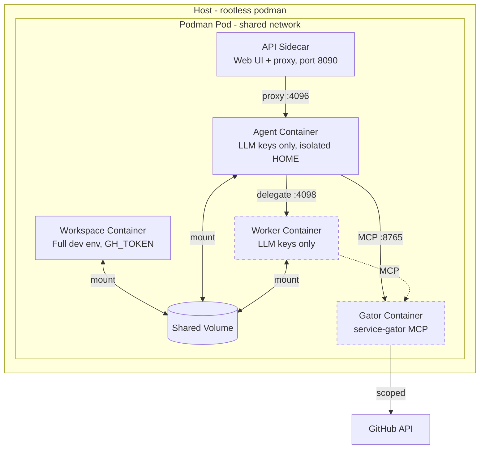

# Sandboxing Model

## Overview

devaipod isolates AI agents using podman pods with multiple containers. Using containerization by default ensures isolation (configurable to what you do in the devcontainer). An additional key security property is credential isolation: the agent container does not receive trusted credentials (GH_TOKEN, etc.), only LLM API keys. Service-gator (optional) controls access to remote services like JIRA, Gitlab, Github etc.

For implementation details, see the Rust module docs in `src/pod.rs`.

## Defense in Depth

1. **Container isolation** — The agent runs in a separate container from the workspace container.

2. **Credential isolation** — The agent does NOT receive trusted credentials like GH_TOKEN, GITLAB_TOKEN, or JIRA_API_TOKEN. It only receives LLM API keys (ANTHROPIC_API_KEY, etc.). This is the primary security boundary. (The worker, when enabled, has the same restriction.)

3. **Isolated home directory** — Each agent's `$HOME` is a separate volume that doesn't contain user credentials from the host.

4. **Authenticated endpoints** — The control plane web UI (:8080) requires a login token for all API routes. The opencode server inside each pod requires Basic Auth with a randomly generated per-pod password. The pod-api sidecar acts as an authenticating proxy to opencode, so external clients never need to know the password directly. Unlike stock `opencode serve`, endpoints are not open by default.

## Architecture



Gator is enabled when service-gator scopes are configured. Worker is enabled via `[orchestration] enabled = true`; the worker's access to gator is configurable via `[orchestration.worker] gator` (default: readonly).

## Container Security

### Workspace Container
- Runs your devcontainer image with full privileges
- Has access to your dotfiles, credentials, and environment (GH_TOKEN, GITLAB_TOKEN, etc.)
- Can run privileged operations (build, test, deploy)
- Functions as a full development environment for human use
- Contains `opencode-connect` shim that connects to the agent

### Agent Container (`{pod}-agent`)
- Same devcontainer image with the same Linux capabilities as workspace (to support nested containers)
- Runs `opencode serve` on port 4096
- **Credential isolation**: Receives only LLM API keys (ANTHROPIC_API_KEY, OPENAI_API_KEY, etc.)
- Does NOT receive trusted credentials (GH_TOKEN, etc.) — accesses external services only via service-gator when available
- Isolated home directory (separate volume)
- Has read/write access to its own workspace clone (`{pod}-agent-workspace` volume)
- Read-only access to the main workspace via `/mnt/main-workspace`

### API Sidecar (`{pod}-api`)
- Serves the vendored opencode SPA (embedded by the control plane via iframe)
- Proxies to the agent's opencode at localhost:4096
- Provides git and PTY endpoints
- Only published port per pod (8090 internal); the control plane at :8080 is the primary user-facing entry point

### Gator Container (optional)
- Enabled when service-gator scopes are configured
- Runs [service-gator](https://github.com/cgwalters/service-gator) MCP server
- Receives trusted credentials (GH_TOKEN, JIRA_API_TOKEN)
- Provides scope-restricted access to external services
- Agent (and worker, if present) connect via MCP protocol, never see raw credentials

### Worker Container (optional, `[orchestration] enabled = true`)
- Same devcontainer image with the same Linux capabilities
- Runs `opencode serve` on port 4098
- Executes subtasks delegated by the agent (which becomes "task owner" when orchestration is enabled)
- **Credential isolation**: Receives only LLM API keys — accesses external services only via service-gator
- Isolated home directory (separate from agent)
- Has its own workspace clone for isolated git operations

## Volume Strategy

Workspace code is cloned into a podman volume (not bind-mounted from host):

- **Volume name:** `{pod_name}-workspace`
- **Benefits:** Avoids UID mapping issues with rootless podman
- **Access:** Workspace and agent containers mount this volume (worker also mounts it when orchestration is enabled)

## Environment Variable Isolation

Environment variables are carefully partitioned:

| Variable Type | Workspace | Agent | API | Worker (opt-in) | Gator (opt-in) |
|---------------|-----------|-------|-----|-----------------|----------------|
| LLM API keys (ANTHROPIC_API_KEY, etc.) | ✅ | ✅ | ❌ | ✅ | ❌ |
| Trusted env (GH_TOKEN, etc.) | ✅ | ❌ | ❌ | ❌ | ✅ |
| Global env allowlist | ✅ | ✅ | ✅ | ✅ | ✅ |
| Project env allowlist | ✅ | ✅ | ❌ | ✅ | ❌ |

The workspace container has full access to trusted credentials, making it suitable for human development work. The agent (and worker, when enabled) are credential-isolated and must use service-gator for any external service access.

Configure trusted environment variables in `~/.config/devaipod.toml`:

```toml
[trusted.env]
allowlist = ["GH_TOKEN", "GITLAB_TOKEN", "JIRA_API_TOKEN"]
```

## Known Limitations

1. **Workspace file access**: The agent (and worker, if enabled) can read/write any file in their respective workspaces. Secrets in `.env` files are visible.

2. **Network access**: All containers have full network access within the pod's shared network namespace.

3. **Same image requirement**: The agent (and worker) containers use the same image as the workspace. OpenCode must be installed in your devcontainer image.

## External Service Access

For operations requiring access to external services (GitHub, JIRA, etc.), agents use the integrated [service-gator](https://github.com/cgwalters/service-gator) MCP server which provides scope-based access control.

See [Service-gator Integration](service-gator.md) for full documentation.
