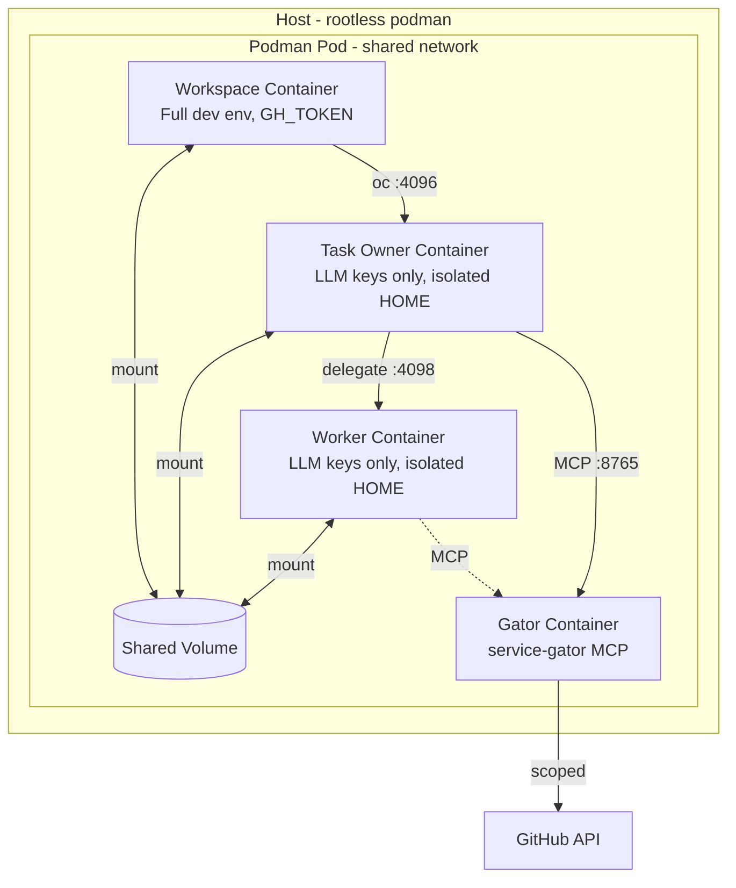

# Sandboxing Model

## Overview

devaipod isolates AI agents using podman pods with multiple containers. Using containerization by default ensures isolation (configurable to what you do in the devcontainer). An additional key security property is credential isolation: the agent containers (task owner and worker) do not receive trusted credentials (GH_TOKEN, etc.), only LLM API keys. Service-gator controls access to remote services like JIRA, Gitlab, Github etc.

For implementation details, see the Rust module docs in `src/pod.rs`.

## Defense in Depth

1. **Container isolation** - The task owner and worker run in separate containers from the workspace container.

2. **Credential isolation** - The task owner and worker do NOT receive trusted credentials like GH_TOKEN, GITLAB_TOKEN, or JIRA_API_TOKEN. They only receive LLM API keys (ANTHROPIC_API_KEY, etc.). This is the primary security boundary.

3. **Isolated home directory** - Each agent's `$HOME` is a separate volume that doesn't contain user credentials from the host.

## Architecture



Note: The worker's access to gator is configurable via `[orchestration.worker] gator` setting (default: readonly).

## Container Security

### Workspace Container
- Runs your devcontainer image with full privileges
- Has access to your dotfiles, credentials, and environment (GH_TOKEN, GITLAB_TOKEN, etc.)
- Can run privileged operations (build, test, deploy)
- Functions as a full development environment for human use
- Contains `opencode-connect` shim that connects to the task owner

### Task Owner Container
- Same devcontainer image with the same Linux capabilities as workspace (to support nested containers)
- Runs `opencode serve` on port 4096
- Orchestrates work by delegating subtasks to the worker
- **Credential isolation**: Receives only LLM API keys (ANTHROPIC_API_KEY, OPENAI_API_KEY, etc.)
- Does NOT receive trusted credentials (GH_TOKEN, etc.) - accesses external services only via service-gator
- Isolated home directory (separate volume)
- Has read/write access to the workspace volume
- Reviews worker commits before merging

### Worker Container
- Same devcontainer image with the same Linux capabilities
- Runs `opencode serve` on port 4098
- Executes subtasks delegated by the task owner
- **Credential isolation**: Receives only LLM API keys - accesses external services only via service-gator
- Isolated home directory (separate from task owner)
- Has its own workspace clone for isolated git operations

### Gator Container (Optional)
- Runs [service-gator](https://github.com/cgwalters/service-gator) MCP server
- Receives trusted credentials (GH_TOKEN, JIRA_API_TOKEN)
- Provides scope-restricted access to external services
- Task owner and worker connect via MCP protocol, never see raw credentials

## Volume Strategy

Workspace code is cloned into a podman volume (not bind-mounted from host):

- **Volume name:** `{pod_name}-workspace`
- **Benefits:** Avoids UID mapping issues with rootless podman
- **Access:** Workspace, task owner, and worker containers all mount this volume

## Environment Variable Isolation

Environment variables are carefully partitioned:

| Variable Type | Workspace | Task Owner | Worker | Gator |
|---------------|-----------|------------|--------|-------|
| LLM API keys (ANTHROPIC_API_KEY, etc.) | ✅ | ✅ | ✅ | ❌ |
| Trusted env (GH_TOKEN, etc.) | ✅ | ❌ | ❌ | ✅ |
| Global env allowlist | ✅ | ✅ | ✅ | ✅ |
| Project env allowlist | ✅ | ✅ | ✅ | ❌ |

The workspace container has full access to trusted credentials, making it suitable for human development work. The task owner and worker containers are credential-isolated and must use service-gator for any external service access.

Configure trusted environment variables in `~/.config/devaipod.toml`:

```toml
[trusted.env]
allowlist = ["GH_TOKEN", "GITLAB_TOKEN", "JIRA_API_TOKEN"]
```

## Known Limitations

1. **Workspace file access**: The task owner and worker can read/write any file in their respective workspaces. Secrets in `.env` files are visible.

2. **Network access**: All containers have full network access within the pod's shared network namespace.

3. **Same image requirement**: The task owner and worker containers use the same image as the workspace. OpenCode must be installed in your devcontainer image.

## External Service Access

For operations requiring access to external services (GitHub, JIRA, etc.), agents use the integrated [service-gator](https://github.com/cgwalters/service-gator) MCP server which provides scope-based access control.

See [Service-gator Integration](service-gator.md) for full documentation.
