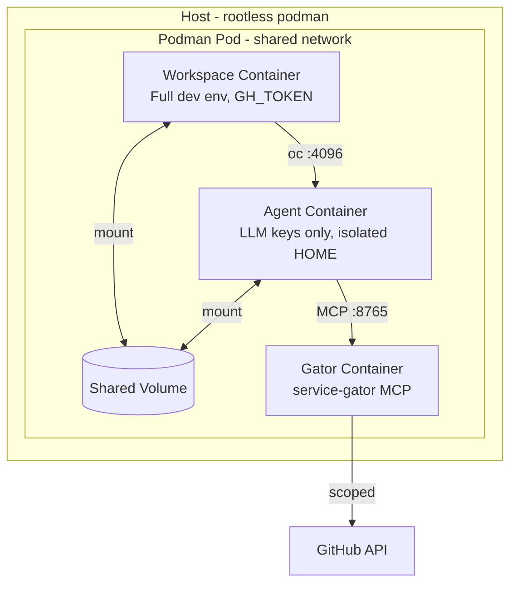

# Sandboxing Model

## Overview

devaipod isolates AI agents using podman pods with multiple containers. Using containerization by default ensures isolation (configurable to what you do in the devcontainer). An additional key security property is credential isolation: the agent container does not receive trusted credentials (GH_TOKEN, etc.), (only LLM API keys) and service-gator controls access to remote services like JIRA, Gitlab, Github etc.

For implementation details, see the Rust module docs in `src/pod.rs`.

## Defense in Depth

1. **Container isolation** - The agent runs in its own container, separate from the workspace container.

2. **Credential isolation** - The agent does NOT receive trusted credentials like GH_TOKEN, GITLAB_TOKEN, or JIRA_API_TOKEN. It only receives LLM API keys (ANTHROPIC_API_KEY, etc.). This is the primary security boundary.

3. **Isolated home directory** - The agent's `$HOME` is a separate volume that doesn't contain user credentials from the host.

## Architecture



## Container Security

### Workspace Container
- Runs your devcontainer image with full privileges
- Has access to your dotfiles, credentials, and environment
- Can run privileged operations (build, test, deploy)
- Contains `opencode-connect` shim that connects to the agent

### Agent Container
- Same devcontainer image with the same Linux capabilities as workspace (to support nested containers)
- Runs `opencode serve` on port 4096
- **Credential isolation**: Receives only LLM API keys (ANTHROPIC_API_KEY, OPENAI_API_KEY, etc.)
- Does NOT receive trusted credentials (GH_TOKEN, etc.)
- Isolated home directory (separate volume)
- Has read/write access to the workspace volume

### Gator Container (Optional)
- Runs [service-gator](https://github.com/cgwalters/service-gator) MCP server
- Receives trusted credentials (GH_TOKEN, JIRA_API_TOKEN)
- Provides scope-restricted access to external services
- Agent connects via MCP protocol, never sees raw credentials

## Volume Strategy

Workspace code is cloned into a podman volume (not bind-mounted from host):

- **Volume name:** `{pod_name}-workspace`
- **Benefits:** Avoids UID mapping issues with rootless podman
- **Access:** Both workspace and agent containers mount this volume

## Environment Variable Isolation

Environment variables are carefully partitioned:

| Variable Type | Workspace | Agent | Gator |
|---------------|-----------|-------|-------|
| LLM API keys (ANTHROPIC_API_KEY, etc.) | ✅ | ✅ | ❌ |
| Trusted env (GH_TOKEN, etc.) | ✅ | ❌ | ✅ |
| Global env allowlist | ✅ | ✅ | ✅ |
| Project env allowlist | ✅ | ✅ | ❌ |

Configure trusted environment variables in `~/.config/devaipod.toml`:

```toml
[trusted.env]
allowlist = ["GH_TOKEN", "GITLAB_TOKEN", "JIRA_API_TOKEN"]
```

## Known Limitations

1. **Workspace file access**: The agent can read/write any file in the workspace. Secrets in `.env` files are visible.

2. **Network access**: The agent has full network access within the pod's shared network namespace.

3. **Same image requirement**: The agent container uses the same image as the workspace. OpenCode must be installed in your devcontainer image.

## External Service Access

For operations requiring access to external services (GitHub, JIRA, etc.), agents use the integrated [service-gator](https://github.com/cgwalters/service-gator) MCP server which provides scope-based access control.

See [Service-gator Integration](service-gator.md) for full documentation.
