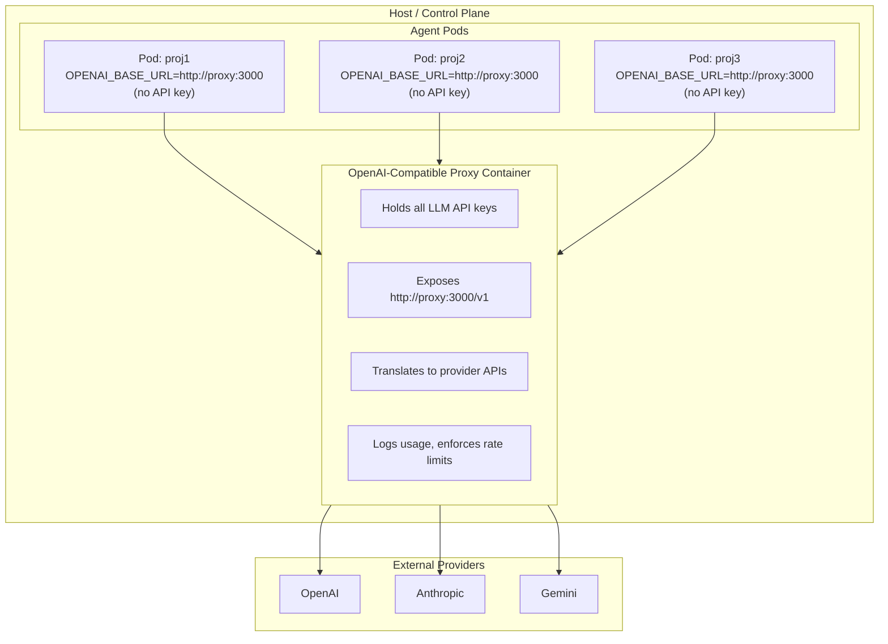

# OpenAI-Compatible Proxy Container

This document explores adding a container image that implements an OpenAI-compatible
API endpoint proxy, centralizing credential management and providing a unified interface
for multiple LLM providers.

## Motivation

Currently, devaipod passes LLM API keys directly to the agent container via environment
variables or podman secrets (see [secrets.md](../src/secrets.md)). While this works,
there are several limitations:

1. **Credential exposure**: The agent container directly holds API keys. A compromised
   agent (via prompt injection or other attack) could exfiltrate these keys.

2. **No usage visibility**: There's no centralized logging of API calls, token usage,
   or costs across pods.

3. **Provider lock-in**: Agent configuration is tied to specific providers. Switching
   from OpenAI to Anthropic requires reconfiguring each pod.

4. **No rate limiting**: Individual pods can exhaust API quotas without coordination.

An OpenAI-compatible proxy would address these by sitting between agents and LLM
providers, holding credentials itself and exposing a credential-free endpoint to agents.

## Architecture



## Existing Solutions

Several mature open-source projects already implement this pattern:

### One-API (Go) - Recommended

Fully MIT-licensed Go project with 29k+ stars. Single binary, low resource usage,
English UI available.

**License:** MIT (no open-core / enterprise carve-outs)

**Running locally is simple:**

```bash
# SQLite-based (simplest, no external DB needed)
docker run --name one-api -d -p 3000:3000 \
  -v $(pwd)/one-api-data:/data \
  justsong/one-api

# Then add channels (providers) via the web UI at http://localhost:3000
# Default login: root / 123456
```

Supports OpenAI, Azure, Anthropic Claude, Google Gemini, DeepSeek, and many others.

**Pros:**
- Fully FOSS (pure MIT, no enterprise directory)
- Single Go binary, minimal resource usage
- SQLite by default (no external DB required), MySQL/PostgreSQL optional
- Token/quota management with multi-tenant support
- Load balancing across channels
- English UI available
- Active development

**Cons:**
- Fewer providers than LiteLLM (but covers major ones: OpenAI, Anthropic, Gemini, etc.)
- Documentation originated in Chinese (English README available)
- Web UI required for channel configuration (no pure config file mode)

### LiteLLM (Python) - Alternative

The most comprehensive solution with 35k+ GitHub stars. Supports 100+ providers
with full request/response translation.

**License:** MIT for the core, but has an `enterprise/` directory with a separate
commercial license. This is an "open-core" model which conflicts with devaipod's
"no open-core" philosophy. The core proxy functionality is MIT-licensed and usable,
but we prefer fully FOSS solutions as defaults.

**Running locally:**

```bash
docker run -v $(pwd)/config.yaml:/app/config.yaml \
  -e ANTHROPIC_API_KEY=$ANTHROPIC_API_KEY \
  -p 4000:4000 \
  docker.litellm.ai/berriai/litellm:main-latest \
  --config /app/config.yaml
```

**Pros:**
- Extensive provider support (100+ providers)
- Config-file based setup
- Built-in cost tracking, guardrails
- Good documentation

**Cons:**
- Open-core model (enterprise features under commercial license)
- Python with moderate memory footprint (~200-500MB)
- Larger dependency tree

### Extend service-gator (Rust) - Native Integration

Service-gator already provides REST proxy functionality for forge APIs (GitHub, GitLab,
Forgejo, JIRA) with fine-grained scope controls. See [PR #14](https://github.com/cgwalters/service-gator/pull/14)
which added per-forge REST proxy servers. The same pattern could be extended for LLM APIs.

**How it would work:**

```bash
# Current: service-gator proxies forge APIs
service-gator --github-port 8081 --gitlab-port 8082

# Extended: also proxy LLM APIs
service-gator --github-port 8081 --openai-port 8090 --anthropic-port 8091
```

The agent would use:
```bash
OPENAI_BASE_URL=http://localhost:8090/v1
# No API key needed - service-gator holds credentials and enforces scopes
```

**Pros:**
- Native Rust, fits devaipod's single-binary philosophy
- Already integrated into devaipod's architecture
- Unified credential management (forge tokens + LLM keys in one place)
- Fine-grained scope controls already implemented for forges, extensible to LLMs
- No additional container needed
- Apache-2.0 OR MIT licensed (fully FOSS)

**Cons:**
- Requires development effort to add LLM provider support
- Need to implement API translation for each provider
- Streaming SSE proxying adds complexity
- Ongoing maintenance as provider APIs evolve

**Estimated effort:** Medium (2-4 weeks for basic OpenAI + Anthropic support)

The translation logic is similar to what One-API/LiteLLM do, but scoped to just
the providers devaipod needs. Service-gator's existing `ApiService` pattern and
`ForgeKind` enum provide a good template for adding `LlmKind`.

### mistral.rs (Rust) - Reference Only

Primarily an inference engine but includes an OpenAI-compatible server. Useful as
a reference for Rust HTTP server patterns but not directly applicable.

**Pros:**
- Native Rust, maximum performance
- Already has OpenAI-compatible HTTP API
- Good reference for Rust HTTP server patterns

**Cons:**
- Focused on local inference, not proxy/gateway
- Would need significant work to add provider translation

## Provider API Differences

Supporting multiple providers requires translating between their APIs. Key differences:

| Aspect | OpenAI | Anthropic | Google Gemini |
|--------|--------|-----------|---------------|
| **Auth Header** | `Authorization: Bearer` | `x-api-key` + `anthropic-version` | Query param or OAuth |
| **Message Format** | `messages` array | `messages` + separate `system` | `contents` array |
| **Role Names** | user/assistant/system | user/assistant | user/model |
| **Streaming** | `delta` in SSE | `content_block_delta` | Different event types |
| **Tool Calling** | `tools` + `tool_choice` | Similar but schema differs | `function_declarations` |
| **Max Tokens** | Optional | Required (default 4096) | `maxOutputTokens` |
| **Temperature** | 0-2 range | 0-1 range | 0-2 range |

### Translation Complexity

**Low complexity (straightforward mapping):**
- Basic chat completions (text in, text out)
- Simple parameter mapping (temperature, max_tokens)
- Token usage normalization

**Medium complexity (requires careful handling):**
- Streaming responses (SSE format differences)
- System message handling (Anthropic separates system from messages)
- Stop sequences (different parameter names/formats)

**High complexity (significant effort):**
- Tool/function calling (schema and response format differences)
- Vision/multimodal (image encoding, MIME types vary)
- Extended thinking/reasoning (Anthropic's thinking blocks, OpenAI's reasoning_effort)
- Structured output (response_format vs output_schema)
- Caching (provider-specific cache headers)

## Implementation Options

### Option 1: Use LiteLLM as-is

Deploy LiteLLM as a sidecar or shared container.

```yaml
# litellm-config.yaml
model_list:
  - model_name: claude-sonnet
    litellm_params:
      model: anthropic/claude-sonnet-4-20250514
      api_key: os.environ/ANTHROPIC_API_KEY
  - model_name: gpt-4
    litellm_params:
      model: openai/gpt-4
      api_key: os.environ/OPENAI_API_KEY
```

**Pros:** Immediate functionality, battle-tested, extensive provider support
**Cons:** Python dependency, larger image, doesn't fit Rust/single-binary philosophy

### Option 2: Wrap One-API in a Container

Deploy One-API with SQLite for simplicity.

**Pros:** Go binary, lower resources than Python, multi-tenant ready
**Cons:** Less provider coverage, different project culture

### Option 3: Extend service-gator (Recommended Long-term)

Add LLM provider support to service-gator, which already proxies forge REST APIs.
This provides native integration with devaipod's existing architecture.

```rust
// Extend service-gator's existing pattern
enum LlmKind {
    OpenAI,
    Anthropic,
    Gemini,
}

// Similar to existing ForgeKind + ApiService pattern
struct LlmService {
    kind: LlmKind,
    api_key: String,
    // Scope controls similar to forge scopes
}
```

Service-gator already handles:
- Per-service port allocation (`--github-port`, `--gitlab-port`, etc.)
- Scope-based authorization
- Request/response proxying with credential injection

Adding `--openai-port` and `--anthropic-port` follows the same pattern.

**Pros:** Native Rust, unified with existing devaipod architecture, no extra container,
fine-grained scope controls, fully FOSS
**Cons:** Development effort required, API translation complexity

### Option 4: Build a Standalone Rust Proxy

If service-gator extension isn't desired, implement a separate focused Rust proxy.

```rust
#[async_trait]
trait LLMProvider {
    fn name(&self) -> &str;
    async fn chat_completion(&self, req: OpenAIChatRequest)
        -> Result<OpenAIChatResponse>;
    async fn chat_completion_stream(&self, req: OpenAIChatRequest)
        -> Result<impl Stream<Item = OpenAIChatChunk>>;
}
```

**Pros:** Fits devaipod's single-binary Rust philosophy, minimal dependencies
**Cons:** Duplicates service-gator patterns, significant development effort

### Option 5: Hybrid Approach

Use One-API initially for rapid deployment, with service-gator extension as the
long-term goal. One-API runs in the same pod network as the agent.

## Credential Management

The proxy would hold credentials, keeping them out of agent containers:

```toml
# ~/.config/devaipod.toml
[proxy]
enabled = true
container_image = "ghcr.io/cgwalters/devaipod-proxy:latest"

# Credentials for the proxy (never reach agent)
[proxy.providers.anthropic]
api_key_secret = "anthropic_api_key"  # podman secret name

[proxy.providers.openai]
api_key_secret = "openai_api_key"

[proxy.providers.vertex]
credentials_path = "/secrets/gcloud-adc.json"  # service account
```

Agents would only receive:

```bash
OPENAI_BASE_URL=http://proxy.pod:4000/v1
OPENAI_API_KEY=""  # Empty or dummy, proxy doesn't require it
```

## Tradeoffs Summary

| Aspect | Pros | Cons |
|--------|------|------|
| **Security** | Keys never in agent container; compromised agent can't exfiltrate | New attack surface (proxy itself); needs secure deployment |
| **Observability** | Centralized logging, cost tracking | Adds complexity; proxy logs need management |
| **Provider flexibility** | Change providers without pod reconfiguration | Translation bugs possible; not all features translate |
| **Performance** | Caching, connection pooling | Added latency (1-10ms typical); extra network hop |
| **Complexity** | Single point of configuration | Another container to manage; failure mode to handle |
| **Compatibility** | Works with any OpenAI-compatible agent | Some advanced features may not translate (extended thinking, etc.) |

## Difficulty Assessment

### Using Existing Solution (LiteLLM/One-API)

**Effort: Low to Medium (1-2 weeks)**

- Container image creation: trivial
- Configuration integration with devaipod: moderate
- Testing across providers: moderate
- Documentation: low

Main work is plumbing the proxy container into devaipod's pod lifecycle.

### Extending service-gator

**Effort: Medium (2-4 weeks for OpenAI + Anthropic)**

- Leverage existing REST proxy infrastructure: already done
- Add LlmKind enum and provider configs: 0.5 weeks
- OpenAI passthrough (simplest case): 0.5 weeks
- Anthropic translation (chat completions + streaming): 1-2 weeks
- Scope controls for LLM access: 0.5 weeks
- Testing: 0.5 weeks
- Ongoing: API changes from providers require updates

Service-gator's existing architecture (per-forge ports, ApiService pattern) provides
a solid foundation. The main work is API translation.

### Building Standalone Rust Proxy

**Effort: High (4-8 weeks for MVP)**

Starting from scratch requires building HTTP server infrastructure that service-gator
already has. Only consider if service-gator extension is undesirable.

## Recommendation

**Short-term**: Use One-API in a container. It's fully MIT-licensed (no open-core),
lightweight (single Go binary), and covers the major providers (OpenAI, Anthropic,
Gemini, etc.). The SQLite default means no external database is required.

**Long-term**: Extend service-gator with LLM provider support. This provides:
- Native Rust integration (no extra container)
- Unified credential management (forge tokens + LLM keys)
- Fine-grained scope controls (already proven for forge APIs)
- Single binary distribution

**Why not LiteLLM?** While LiteLLM has broader provider support, it uses an open-core
model with an `enterprise/` directory under commercial license. devaipod's philosophy
is "no open-core" so we prefer fully FOSS solutions as defaults.

**Configuration approach (short-term with One-API)**:

```toml
[proxy]
enabled = true  # Default: false, agents get keys directly
image = "docker.io/justsong/one-api:latest"

[proxy.secrets]
# Credentials are configured via One-API's web UI after startup
# One-API stores them encrypted in its SQLite database
```

When `proxy.enabled = true`:
1. devaipod starts proxy container in the pod network
2. Agent containers get `OPENAI_BASE_URL=http://proxy:3000/v1` instead of API keys
3. Proxy container holds provider credentials (configured via its web UI)

**Configuration approach (long-term with service-gator)**:

```toml
[gator]
# Existing forge configuration
github_scope = "owner:cgwalters repo:devaipod"

# New: LLM provider configuration
[gator.llm]
openai_port = 8090
anthropic_port = 8091

[gator.llm.anthropic]
api_key_secret = "anthropic_api_key"  # podman secret name
# Scope controls (future): limit models, rate limits, etc.

[gator.llm.openai]
api_key_secret = "openai_api_key"
```

Service-gator would expose LLM endpoints alongside forge endpoints, with the same
scope-based authorization model.

## Open Questions

1. **Shared vs per-pod proxy**: Should there be one proxy for all pods, or one per pod?
   Shared is more efficient but complicates networking. (Service-gator already runs
   per-pod, so this is naturally per-pod.)

2. **Fallback behavior**: What happens if the proxy is down? Should agents fail, or
   fall back to direct API access (which would require keys)?

3. **Model routing**: How should agents specify which model/provider to use? Model
   name prefixes (e.g., `anthropic/claude-sonnet`) or transparent routing?

4. **Rate limiting scope**: Per-pod, per-user, or global limits?

5. **LLM scope controls**: What scopes make sense for LLM access? Model allowlists?
   Token/cost limits? Request rate limits?

## References

- [service-gator REST proxy PR](https://github.com/cgwalters/service-gator/pull/14) - Existing REST proxy for forges
- [service-gator GitHub](https://github.com/cgwalters/service-gator)
- [One-API GitHub](https://github.com/songquanpeng/one-api) - Fully MIT-licensed proxy
- [LiteLLM Documentation](https://docs.litellm.ai) - Open-core alternative
- [OpenAI API Reference](https://platform.openai.com/docs/api-reference)
- [Anthropic API Reference](https://docs.anthropic.com/en/api)
- [devaipod Secrets Documentation](../src/secrets.md)
- [devaipod Design Philosophy](../src/design.md)
